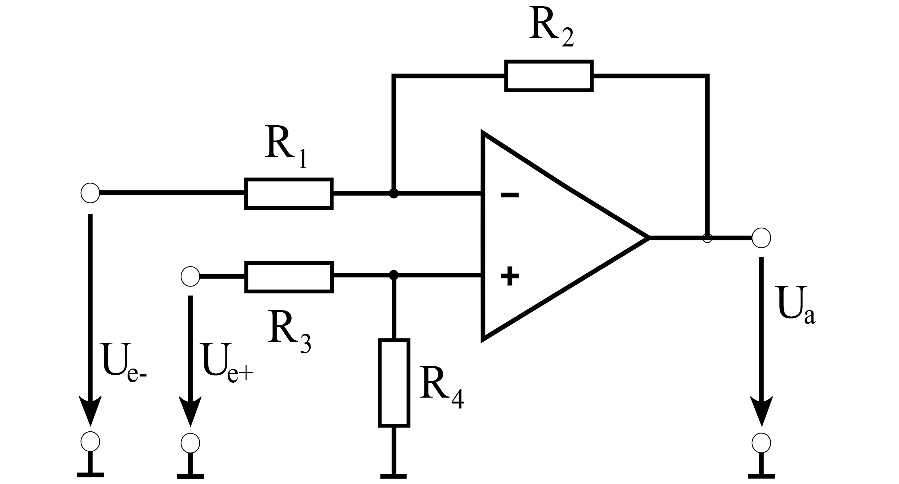

# GENERAL RESEARCH NOTES
A brain dump of what I am learning for this project.

## 1. Fundamentals [1]

### What is EMG?
EMG stands for **Electromyography**. This is a signal that represents the electrical potentials (V) in muscles when they contract, which is always controlled by the nervous system. EMG signals tend to be noisy, being distorted by: 
- tissues
- other moving muscles

This affects the output potentials read on electrodes. 

There have been many advancements in creating algorithms and hardware interfaces that use EMG signals for things like prosthetics, activating devices, or general medical tracking and diagnosis support.

It is common to hear terms like "myoelectric activity" or "myographic action potential" in reference to EMG.

*A note from the paper:*
>The combination of the muscle fiber action potentials from all the muscle fibers of a single motor unit is the motor unit action potential (MUAP) which can be detected by a skin surface electrode (non-invasive)

Although humans are electrically neutral, the nerve cell membrane is not. In its resting state, it's membrane is polarized since the concentrations of the plasma membrane and that of ions is not homogeneous throughout the cell. The paper explains how this creates EMG signals: 
>A potential difference exists between the intra-cellular and extracellular fluids of the cell. In response to a stimulus from the neuron, a muscle fiber depolarizes [where the internal signal flips thanks to the stimulus from the signal (thanks Claude!)] as the signal propagates along its surface and the fiber twitches. This depolarization, accompanied by a movement of ions, generates an electric field near each muscle fiber [like in a capacitor!]. An EMG signal is the train of [MUAPs] showing the muscle response to neural stimulation. 

### Why? And what do these signals tell us?
EMG signals are of importance nowadays, since they help with understanding movements and in physical rehab. Furthermore, the "shapes and firing rates of Motor Unit Action Potentials (MUAPs)" help in determining and understanding neuromuscular disorders. 

### Things that affect the signal:
When detecting EMG signals from the surface, like in the dry electrode application, there are a few considerations for the clarity of outputs:

1. Signal-to-noise ratio
    - How much energy the EMG signal we care about produces vs. things external to the signal like powerline interference
2. Distortion of the signal
    - can be from other MUAPs, tissues altering the signal, etc.

*A note from the paper:*
>When EMG is acquired from electrodes mounted directly on the skin, the signal is a composite of all the muscle fiber action potentials occurring in the muscles underlying the skin. These action potentials occur at random intervals. So at any one moment, the EMG signal may be either positive or negative voltage.

### How do people get usable data out of these tiny signals?
Amplifying these signals is **imperative** for getting real outputs. Typically, instrumental amplifiers like the INA333 are used as a first stage, where later on people tend to use a variety of amplification processes. For example, using **differential amplifiers** helps exaggerate the difference in the MUAPs, which is more telling of when a contraction occurs. In conjunction with these stages, a mediative bandpass filter is typically applied to reject very low and very high frequencies out of the picture.

Here is a differential amplifier. Typically, R1=R2 and R3=R4, yielding an amplification equation of:

$$U_{a} = \frac{R_2}{R_1}(U_{e+} - U_{e-})$$ [2]

[3]

## 2. Tools Needed
WIP
